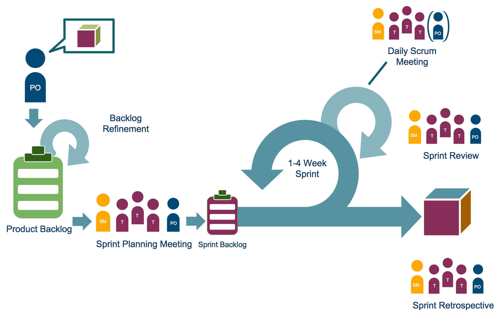

# Scrum

## Scrum owner
### Responsibility
He or she represents the end customers and/or other stakeholders and is responsible for maximizing 
the value of the product by ensuring that the Scrum Team delivers the right work at the right time. 
The Scrum Product Owner decides the software requirements provided for a specific software version, 
and when the software will be released. She represents functional and nonfunctional demands from end-users.

### Tasks
- To manage and clarify project requirements,
- To guide releases and to ensure return on investment (ROI),
- To closely work with the Scrum Team and enable it to deliver the correct work on time,
- To manage stakeholders and their expectations,
- To manage the Scrum Product Backlog.

#### Managing the Product Backlog
- Create, maintain and clearly describe user stories in the Scrum Product Backlog,
- Prioritize user stories to accomplish business goals and fulfil the mission of software product,
- Ensure that the Scrum Team correctly comprehends and implements the user stories in the Scrum Product Backlog.

#### Release Management
The Scrum Product Owner is responsible for reaching the project goals. He or she creates and maintains the release plan 
and decides about deliveries, end-user functions, and the order they need to be delivered.

#### Stakeholder Management
External stakeholders should not directly bring their demands to the Scrum Team members. 
Instead, the Scrum Product Owner should collect and assess required functionalities with the stakeholders.

#### Collaboration With The Scrum Team
The Scrum Product Owner is responsible for ensuring that the Scrum Team members are informed 
and aligned about the aimed goals of software they're building.

During Sprint Review Meetings, the Scrum Product Owner is responsible for inspecting, accepting, 
or declining deliverables of the Scrum Team.

(vgl https://www.scrum-institute.org/the-scrum-product-owner-role-scrum-framework.php)

## Scrum master
### Responsibility
The Scrum Master serves all participants of a Scrum Project and the external stakeholders to comprehend 
and apply the Scrum Framework correctly.

### Tasks
- To establish the Scrum Framework in his or her business and IT ecosystem,
- To act as a change agent and support the adaptation of existing processes to maximize productivity of the Scrum Team.
- To coach the Scrum Team to understand and live the values of the Scrum Framework,
- To ensure efficient and close collaboration between the Scrum Product Owner and the Scrum Team,
- To remove impediments which hinder the continuity of work,
- To lead progress of work by serving,
- To moderate the Scrum Rituals (Scrum Events).
- To guard the Scrum Team from external interference and interruptions while the team does work it has originally committed for a Sprint.

### Facilitation of Scrum Rituals (Event)
The Scrum Framework defines several meetings that have to be organized and facilitated by the Scrum Master:

- Scrum Grooming (Backlog Refinement) Meetings,
- Sprint Planning Meetings
- Daily Scrum Meetings,
- Sprint Review Meetings, and
- Sprint Retrospective Meetings

(vgl https://www.scrum-institute.org/the-scrum-master-role-scrum-framework.php)

## Developer (Scrum Team)
### Characteristics of a Scrum Team
Scrum Teams always have the following characteristics:

- Team members share the same norms and rules
- The Scrum team as a whole is accountable for the delivery
- The Scrum Team is empowered
- It is working as autonomous as it is possible
- The Scrum Team is self organizing
- The skills within the Scrum team are balanced
- A Scrum Team is small and has no sub-teams
- The people within the Scrum Team work full time in the team
- People are collocated

### Rules & Norms
Examples for such norms and rules are:

- time and location of the Daily Scrum Meeting
- the Definition Of Done (DoD) used to decide if work is finished or not
- coding guidelines
- tools to use

### Accountability
The Scrum Team as a whole is responsible to deliver the committed delivery in time and with the defined quality. 
A good result or a failure is never attributed to a single team member but always the result of the Scrum Team.

### Empowerment & Self organization
The Scrum Team has to be empowered to define

- what it will commit to deliver at the end of the sprint
- how the expected results have to be broken down into tasks
- who will perform the task and in which order they are performed

Only if the Scrum Team is empowered to decide these things it will work with 
the highest possible motivation and performance.

### Responsibilities of the Scrum Team
The Scrum Team and each of the team members has certain responsibilities which have to be fulfilled:

- They have to breakdown the requirements, create task, estimate and distribute them. In other words this means 
that they have to create the Sprint Backlog.
- They have to perform the short Daily Sprint Meeting.
- They have to ensure that at the end of the Sprint potentially shippable functionality is delivered.
- They have to update the status and the remaining efforts for their tasks to allow creation of a Sprint Burndown Diagram.

(vgl. https://www.scrum-institute.org/Scrum_Roles_The_Scrum_Team.php)

## Scrum review

## Scrum retro