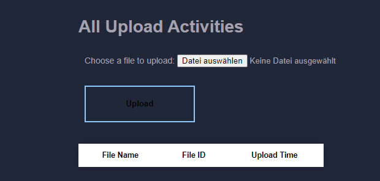
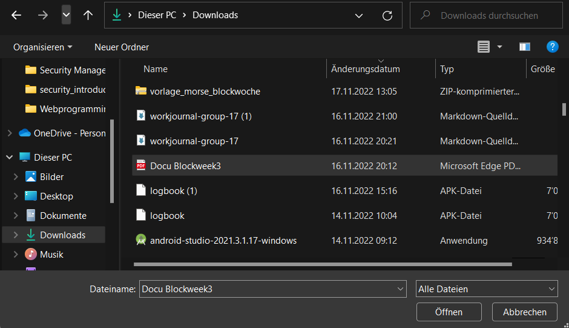
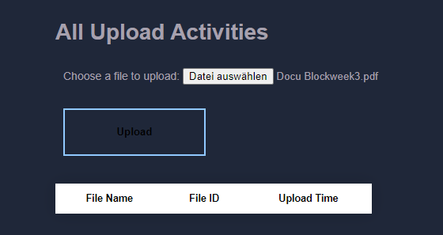
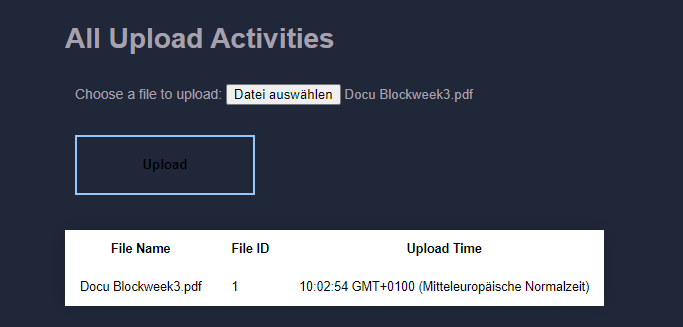
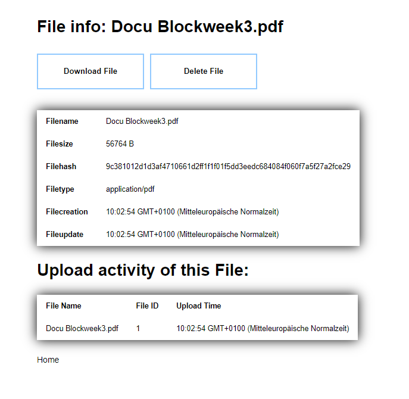
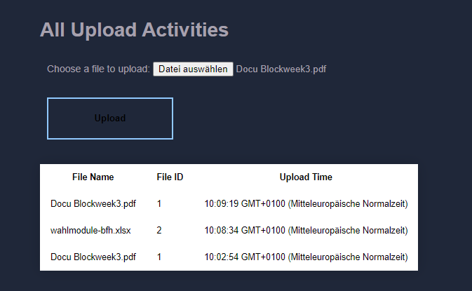
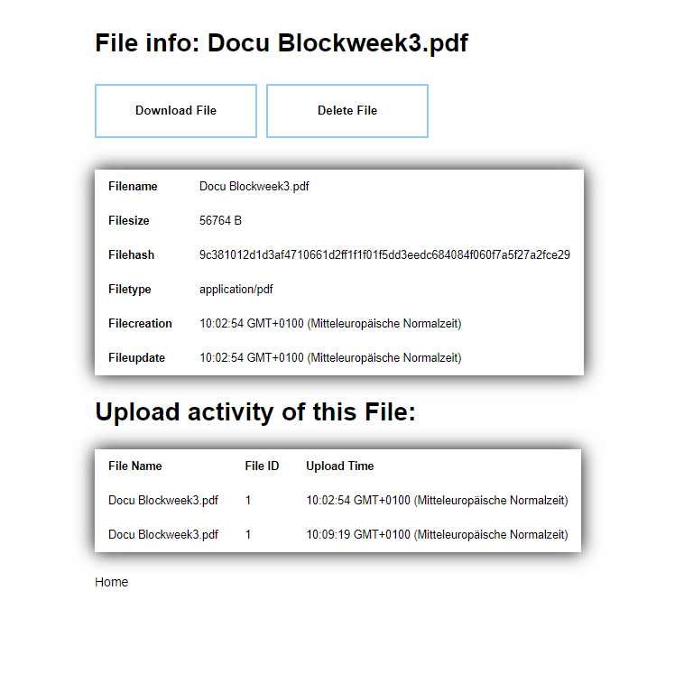

# User Documentation

## Table of contents
- [Overview](#overview)
- [Upload a File](#upload-a-file)
- [File info and Upload Activity of this File](#file-info-and-upload-activity-of-this-file)
- [Upload a File twice](#upload-a-file-twice)
- [Problems](#problems)

### Overview

On the starting page, the user has an overview of the files he uploaded last. Now at the start this overview is empty. 
The user now proceeds step-by-step. 
Step 1: Select a file, Step 2: Upload a file, Step 3: File infos and upload activity of this file can be viewed.

### Upload a file

To upload a file, the user clicks on the field "Datei hochladen" and then selects the file to upload.

Now the user has to commit by clicking "Öffnen". The starting page looks now a bit different. After "Datei hochladen" 
there is the chosen file.

The user has to commit by clicking the "Upload" field.
Now the file is uploaded and there is a first entry in the list with: File Name, File ID and Upload Time.

### File info and Upload Activity of this File

To go to the File info and Upload Activity of this File page, the user clicks on File ID number. He comes then to the
File info and Upload Activity of this File page.

By clicking the "home" button the user comes to the home page with the files he uploaded last.

### Upload a File twice

The user can upload a file more than once. Reasons for this could be, that the file has changed or that 
the analysing process has changed. The procedure to upload keeps the same.

After uploading the file, the last upload of the file comes first. And then by clicking the File ID number the user 
comes to the File info page and this time there are two upload activities for this file.

### Problems

We have determined some tasks and discussed which ones we will include in the backlog for the sprint 2.
[sprint2 backlog](https://github.com/orgs/bfhmea4/projects/4/views/6)